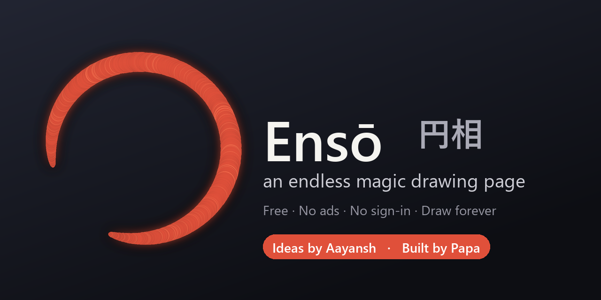

<div align="center">

<a href="https://techtimerdubai.github.io/Enso/"></a>

# Ensō 円相 ✨
### an endless magic drawing page

**Draw as big as you want. The paper never ends!**

🎨 [**Tap here to play →**](https://techtimerdubai.github.io/Enso/) 🎨

*Free • No ads • No sign-in • Works on your phone, tablet or computer*

**Ideas by Aayansh 🌟 · Built by Papa 💛**

</div>

---

## 🖍️ What is Ensō?

Ensō is a **giant, never-ending sheet of paper** that lives on your screen. You can draw a tiny dot, then zoom in and draw a whole world inside it — then zoom out and it's still just a dot! There are no edges, ever. 🌀

The name *Ensō* (円相) comes from a Japanese brush circle painted in **one big breath** — a symbol of *no beginning and no end*. Perfect for a page that goes on forever!

## 🌈 Cool things you can do

- 🖌️ **8 magic brushes** — inky brush, pen, pencil, marker, crayon, calligraphy, and a **glowing neon** one!
- 🌈 **Rainbow brush** — every line comes out a different colour, like magic.
- ⭐ **Stickers** — pop stars, hearts, animals and more onto your picture.
- ❋ **Mandala mode** — draw one line and it copies itself all around in a beautiful pattern.
- ✦ **Shape magic** — draw a wobbly circle or square and *poof* — it turns perfect!
- 🔍 **Zoom forever** — worlds inside worlds inside worlds.
- ↩️ **Oops button** — undo anything, as many times as you like.
- ▶️ **Watch it draw itself** — replay your whole picture like a little movie (and save it!).
- 🧅 **Layers** — like clear sheets you can stack, hide and fade.
- 🖐️ **Pick things up** — lasso around your drawing to move, grow, spin or copy it.
- 印 **Your own stamp** — type your name and get a one-of-a-kind ink seal.
- 💾 **Keep your art** — save a picture (PNG), a poster (SVG), or your whole drawing to open again later.
- 📤 **Share it** — send your picture to family in one tap.

## 📱 Put it on your device (like a real app)

Open the [drawing page](https://techtimerdubai.github.io/Enso/) and:

- **Phone / tablet:** open the browser menu → **Add to Home screen**
- **Computer (Chrome/Edge):** open the ⋮⋮⋮ menu inside Ensō → **Install app**

Now Ensō sits on your home screen and even works **without internet**! 🚀

## 🕹️ How to play

- **Draw** — just touch and drag (or use a pen/stylus — it feels pressure!).
- **Zoom** — pinch with two fingers, or scroll the mouse wheel.
- **Move around** — drag with two fingers, or hold `Space` and drag.
- **The round button** (bottom-right) opens all the **tools** — tap a colour bubble to pick a brush.
- **Colours** live on the little tab on the right — tap it to open your paint box.
- **The ⋮⋮⋮ button** (bottom middle) has undo, redo, the menu, and clear.

### 🤫 Secret keyboard tricks (for computers)
`B` brush · `E` eraser · `V` select · `S` mandala · `Z` hide everything · `0` fit your art on screen · `Ctrl+Z` undo

## 🔒 Is it safe?

Yes! Ensō is **super safe for kids**:
- No ads, ever.
- No sign-up, no email, no account.
- Nothing is sent anywhere — your drawings stay **right on your device**.
- 100% free and open — anyone can see how it's made.

## 💛 Who made it?

- **Aayansh** dreamed up the ideas 🌟
- **Papa** built it 💛

If Ensō makes you smile, you can send a tiny thank-you tip in the app (**Menu → Support**). It's totally optional — Ensō is free forever. 🌱

## 🛠️ For grown-ups & tinkerers

Plain HTML + CSS + vanilla JavaScript on a single `<canvas>`. No build step, no dependencies, no framework — just static files on GitHub Pages. Strokes are stored as **vectors in world space**, so zoom stays razor-sharp at any level. Installable, offline-capable PWA. Works on Chrome, Safari, Firefox, Edge, Android and iOS.

```bash
# run it locally — any static server works
python -m http.server 8080   # then open http://localhost:8080
```

## 📄 License

**MIT** — do anything you like with it. Not affiliated with any other app.

Made with love. Now go fill the endless page! 🎨✨

<div align="center">

**Ideas by Aayansh 🌟 · Built by Papa 💛**

</div>
