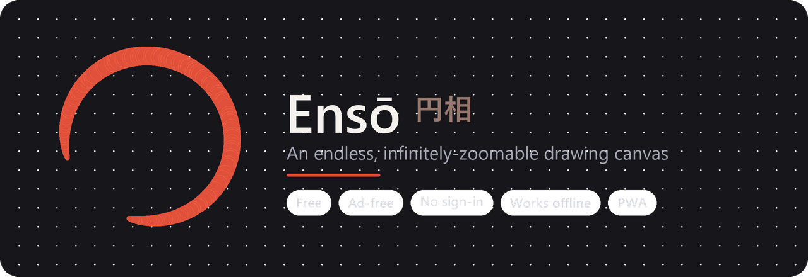

<div align="center">

<a href="https://techtimerdubai.github.io/Enso/"></a>

# Ensō 円相

### An endless, infinitely-zoomable drawing canvas for everyone

**Draw as big as you want — the paper never ends.**

[**▶ Open the live app**](https://techtimerdubai.github.io/Enso/) &nbsp;·&nbsp; Free &nbsp;·&nbsp; No ads &nbsp;·&nbsp; No sign-in &nbsp;·&nbsp; Works offline


</div>

---

## Overview

**Ensō** (named after the Japanese *ensō* — a circle drawn in a single breath, symbolising *no beginning and no end*) is a free, infinite-canvas drawing app that runs entirely in the browser. There are no edges: draw a tiny dot, zoom in, and draw an entire world inside it — down to **10 billion percent** — with strokes that stay razor-sharp at every level, because everything is stored as vectors and re-rendered live.

It is built to be **fast, private, and delightful**: a natural, low-latency drawing feel with a professional brush engine, wrapped in a clean, minimal interface that is friendly enough for a child and capable enough for a serious sketch. Nothing you draw ever leaves your device.

### Why it exists
A free, ad-free, sign-in-free alternative to paid infinite-canvas apps — one that is genuinely enjoyable to use, works offline as an installable app, and treats your privacy as non-negotiable.

---

## Features

🎨 **Professional brush engine** — eight expressive brushes (ink brush, pen, fineliner, pencil, highlighter, crayon, calligraphy, glowing neon) with pressure and speed dynamics, One-Euro smoothing, predicted-input for glued-to-the-pen latency, and Catmull-Rom curve smoothing for glassy strokes.

🔭 **Truly infinite zoom** — zoom to **10,000,000,000%** and keep drawing with unlimited detail. A floating-origin coordinate system keeps everything crisp anywhere on the endless plane.

🌈 **Rainbow & full-colour palette** — a curated palette, custom colour picker, eyedropper, recent colours, and a magic rainbow brush.

🖼️ **Photos & artwork** — drop a photo from your gallery or camera onto the canvas, then move, resize, rotate, and draw on top of it.

⭐ **Stickers & mandala mode** — playful emoji stickers, plus a symmetry mode that mirrors your strokes into kaleidoscopic patterns.

✦ **Shape snapping** — draw a rough circle, box, triangle, or line and it snaps to a perfect shape.

🧅 **Layers** — stack, hide, reorder, and fade layers like sheets of tracing paper.

🖐️ **Select & transform** — lasso a region to move, scale, rotate, duplicate, or delete it.

印 **Personal ink seal** — type a name and generate a one-of-a-kind hanko-style signature stamp.

▶️ **Time-lapse replay** — watch your drawing redraw itself and export it as a video.

💾 **Export & share** — save as PNG, SVG, or an editable Ensō file, or share in one tap.

📱 **Installable PWA** — add it to your home screen and use it fully offline.

🔒 **Private by design** — no ads, no accounts, no tracking; drawings stay on your device.

> **Screenshots:** the fastest way to see Ensō is the [live app](https://techtimerdubai.github.io/Enso/) — it runs instantly with nothing to install. The banner above is a stylised preview.

---

## Installation & setup

Ensō is a **zero-build static web app** — plain HTML, CSS, and vanilla JavaScript. No frameworks, no bundler, no dependencies.

### Run it locally
Any static file server works. For example, with Python:

```bash
# from the project folder
python -m http.server 8080
# then open http://localhost:8080
```

Or with Node:

```bash
npx serve .
```

> A local server is required (rather than opening `index.html` directly) so that the service worker and manifest load correctly.

### Deploy it
Because it is static, it hosts anywhere:

- **GitHub Pages** — push to a repo and enable Pages (this is how the live app is hosted).
- **Netlify / Cloudflare Pages / Vercel** — drag-and-drop the folder or connect the repo; no build command needed (publish directory = project root).

### Install as an app
Open the [live app](https://techtimerdubai.github.io/Enso/) and:
- **Phone / tablet:** browser menu → **Add to Home screen**.
- **Desktop (Chrome / Edge):** the **⋮⋮⋮ menu inside Ensō → Install app**.

---

## Usage

### Basics
- **Draw** — touch and drag, or use a pen/stylus (pressure-sensitive).
- **Zoom** — pinch with two fingers, or scroll the mouse wheel.
- **Pan** — drag with two fingers, or hold `Space` and drag.
- **Toolbar** — one bar at the bottom holds everything: the active tool, favourite colours, undo/redo, clear, and the menu. Tap the tool or colour button to open its tray.

### Keyboard shortcuts (desktop)
| Key | Action | Key | Action |
|-----|--------|-----|--------|
| `B` | Brush | `E` | Eraser |
| `V` | Select / move | `S` | Mandala symmetry |
| `H` / `Space` | Pan | `Z` | Zen mode (hide UI) |
| `0` | Fit drawing to screen | `Ctrl/⌘ + Z` | Undo |
| `Ctrl/⌘ + Shift + Z` | Redo | `Ctrl/⌘ + D` | Duplicate selection |

### Example workflows
- **Trace a photo:** Menu → **Photo** → pick an image → it drops in selected → resize with the corners → switch to a brush and draw over it.
- **Make a mandala:** tap **Mandala** in the tool tray → draw one stroke → it mirrors into a symmetric pattern.
- **Sign your art:** Menu → **Ink seal** → type your name → **Use as signature** → tap the canvas to stamp it.
- **Save your work:** Menu → **PNG** (image), **SVG** (vector), or **Save file** (re-openable `.enso.json`).

---

## Project structure

```
Enso/
├── index.html            App shell and all UI markup
├── style.css             All styling (glassmorphic dark UI, responsive, safe-area aware)
├── app.js                The entire application — a single IIFE:
│                           • infinite-canvas engine (world-space vectors, camera, DPR)
│                           • brush engine, smoothing, shape recognition
│                           • layers, selection & affine transforms
│                           • floating-origin re-basing for deep zoom
│                           • PWA install, export/share, replay, ink seal
├── sw.js                 Service worker (network-first, offline-capable, versioned cache)
├── manifest.webmanifest  PWA manifest (name, icons, theme)
├── icons/                App icons (SVG + PNG) and social-preview images
├── LICENSE               Source-available licence (see below)
└── README.md             This file
```

**Architecture in one line:** strokes are stored as vectors in world space and re-rasterised on a single `<canvas>` at the live zoom every frame, which is why the drawing stays sharp at any magnification.

---

## Contributing

Bug reports, ideas, and feedback are genuinely welcome:

1. **Found a bug or have an idea?** Open a GitHub issue with steps to reproduce (and your device/browser for bugs).
2. **Want to contribute code?** Because Ensō is source-available rather than permissively licensed (see below), please **open an issue first** to discuss the change, or contact **techtimerdubai@gmail.com**. Code contributions are accepted by arrangement so that licensing stays clear for everyone.
3. **Style:** keep it dependency-free and vanilla — the whole point is a fast, self-contained app with no build step.

---

## FAQ & troubleshooting

**Is it really free? What's the catch?**
Yes — free, no ads, no sign-in, no catch. Drawings stay on your device.

**Is my data collected?**
No. There is no analytics, no account, and no server. Your work is saved locally in your browser and never uploaded.

**I updated the app but still see the old version.**
Fully close and reopen the tab/app so the service worker can activate the new version; if needed, refresh once more.

**My drawing disappeared.**
Ensō autosaves to your browser's local storage. Clearing your browser data, or using private/incognito mode, will remove it. Use **Menu → Save file** to keep a permanent, re-openable backup.

**Photos look blurry when I zoom in very far.**
Drawings are vectors and stay sharp forever, but a photo is a fixed grid of pixels — past its native resolution it softens (this is true of every app). Import at the highest resolution you have.

**Does it work offline?**
Yes, once installed as a PWA it works with no internet connection.

**Which devices and browsers are supported?**
Chrome, Edge, Safari, and Firefox on Android, iOS, and desktop. It is optimised for Android and stylus input (pressure, palm rejection).

---

## Credits & acknowledgements

- **Ideas & inspiration** — Aayansh 🌟
- **Design & development** — Papa 💛
- Inspired by the spirit of the Japanese **ensō** and the joy of endless paper.

If Ensō brings a little calm or fun to your day and you'd like to say thanks, there's an optional crypto tip jar under **Menu → Support**. It's entirely optional — Ensō is free forever.

---

## License & copyright

**Copyright © 2026 techtimerdubai. All rights reserved.**

Ensō is **source-available**: the code is published openly so anyone can read, study, and learn from it, and the app is free to use for personal enjoyment. It is **not** offered under a permissive open-source licence.

Anyone wishing to **reuse, redistribute, modify, or use this code beyond the terms of the licence** — including any commercial use — must first obtain permission. For permission or licensing inquiries, please contact:

📧 **techtimerdubai@gmail.com**

See the [LICENSE](LICENSE) file for full terms.

<div align="center">

*Made with care. Now go fill the endless page.* 🎨✨

</div>
